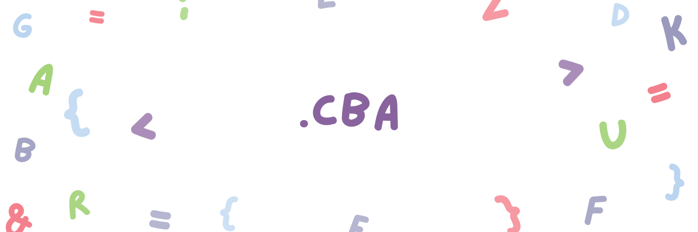

[](https://opensource.org/licenses/MIT)
[](https://github.com/asifali411/cba/releases/latest)
[](https://github.com/asifali411/cba/actions)

# cba


**cba** is a lightweight build automation tool that lets you define build tasks, dependencies, variables, compiler flags, and shell commands in a simple configuration file.

It is designed to keep build scripts small, readable, and easy to understand.

## Features

- Simple task-based configuration
- Task dependencies with `needs`
- Variables for reusable configuration
- Command execution with `run`
- Command-line argument support
- Minimal syntax
- Suitable for C/C++ and other projects that can be built from shell commands

## Installation

### Linux / macOS

Download and run the install script, which pulls the correct binary for your platform from the [latest release](https://github.com/asifali411/cba/releases/latest), verifies its checksum, and installs it to `/usr/local/bin` (or `~/.local/bin` if that isn't writable):

```sh
curl -fsSL https://raw.githubusercontent.com/asifali411/cba/main/scripts/install.sh | bash
```

To install a specific version, download `install.sh` and run it with `-v`:

```sh
curl -fsSL -o install.sh https://raw.githubusercontent.com/asifali411/cba/main/scripts/install.sh
chmod +x install.sh
./install.sh -v v1.2.3
```

### Windows

Run the install script in PowerShell, which downloads the Windows release, verifies its checksum, and installs it to `%LOCALAPPDATA%\cba\bin`:

```powershell
irm https://raw.githubusercontent.com/asifali411/cba/main/scripts/install.ps1 | iex
```

To install a specific version:

```powershell
Invoke-WebRequest -Uri https://raw.githubusercontent.com/asifali411/cba/main/scripts/install.ps1 -OutFile install.ps1
.\install.ps1 -Version v1.2.3
```

### Manual Download

Prebuilt binaries for Linux (x86_64/aarch64), macOS (x86_64/aarch64), and Windows (x86_64) are attached to each [GitHub Release](https://github.com/asifali411/cba/releases), along with `.sha256` checksum files. Download the archive for your platform, verify the checksum, extract it, and place the `cba` binary somewhere on your `PATH`.

### Build from Source

With the [Rust toolchain](https://rustup.rs/) installed:

```sh
git clone https://github.com/asifali411/cba.git
cd cba
cargo build --release
```

The compiled binary will be at `target/release/cba`.

## Example

Create a `cba` file in your project:

```
var compiler = "gcc";
var flags = "-Wall -O2";

task build {
  run "{compiler} {flags} src/main.c -o app";
}

task test {
  needs build;
  run "./app --test";
}

task clean {
  run "rm -f app";
}
```

You can then run individual tasks using `cba`.

For example:

```
cba build
cba test
cba clean
```

## Configuration

A cba configuration file consists of variables and tasks.

### Variables

Variables can be declared with `var`:

```
var compiler = "gcc";
var flags = "-Wall -O2";
```

Variables can then be referenced inside commands using `{name}`:

```
run "{compiler} {flags} src/main.c -o app";
```

This makes it easy to change build configuration without modifying every command.

### Tasks

Tasks are declared using `task`:

```
task build {
  run "gcc src/main.c -o app";
}
```

A task contains one or more commands that cba executes when the task is invoked.

### Dependencies

Tasks can depend on other tasks using `needs`:

```
task test {
  needs build;
  run "./app --test";
}
```

Running:

```
cba test
```

will first execute `build`, then execute the test command.

This allows you to create task pipelines without manually running every step.

## Command-Line Usage

```
cba [OPTIONS] [TOOL_ARGS...] [-- COMMAND_ARGS...]
```

Everything before `--` that isn't consumed by an option below is forwarded as **tool args** (the tasks to run, in order). Everything after `--` is forwarded as **command args**, which become available to tasks through the `{args}` variable.

### Options

| Flag | Description |
| --- | --- |
| `-h`, `--help` | Print help information |
| `-v`, `--version` | Print version information |
| `-p`, `--path <PATH>` | Path to the project root (default: `./`) |

### Running Tasks

You can run one or more tasks by naming them as tool args:

```
cba build
cba test
cba clean
cba build test
```

When multiple tasks are given, they are run in the order listed (subject to their `needs` dependencies).

### Using a Custom Config Path

By default, cba looks for a file named `cba.txt` in the current directory. Use `-p`/`--path` to point it to a different directory:

```
cba -p "./test/proj" build test
```

## Command Arguments

Commands can use the special `{args}` variable to receive arguments passed after `--` on the command line.

For example:

```
task build {
  run "{compiler} {flags} {args} src/main.c -o {output}";
}
```

This allows additional arguments to be passed from the command line:

```
cba build -- -g
```

can result in a command similar to:

```
gcc -Wall -O2 -g src/main.c -o app
```

Note that command arguments must be separated from tasks/options using `--`.

You can combine a custom path, multiple tasks, and command args in a single invocation:

```
cba -p "./test/proj" build test -- -Wall -Wextra
```

## A More Complete Example

A small C project might use:

```
var compiler = "gcc";
var flags = "-Wall -Wextra -O2";
var output = "app";

task build {
  run "{compiler} {flags} src/main.c -o {output}";
}

task test {
  needs build;
  run "./{output} --test";
}

task execute {
  needs build;
  run "./{output}";
}

task clean {
  run "rm -f {output}";
}
```

Then the development workflow becomes:

```
cba build
cba test
cba execute
cba clean
```

## Why cba?

Traditional build systems can be powerful, but they can also introduce a lot of syntax and configuration for small projects.

cba aims to provide a smaller alternative:

```
task build {
  run "gcc main.c -o app";
}

task test {
  needs build;
  run "./app --test";
}
```

The configuration stays close to the commands you would run manually.

## Project Structure

A typical project might look like:

```
my-project/
├── cba.txt
├── src/
│   └── main.c
└── README.md
```

The `cba.txt` file describes how the project is built and tested.

## Commands

The basic usage is:

```
cba <task>
```

For example:

```
cba build
cba test
cba clean
cba --help
cba --version
```

## Design Goals

cba is built around a few simple ideas:

1. **Readable configuration** — build files should be easy to understand.
2. **Minimal syntax** — common build tasks should require very little configuration.
3. **Explicit dependencies** — task relationships should be easy to see.
4. **Shell-friendly** — cba should work naturally with existing command-line tools.
5. **Small projects first** — simple projects should not need a complicated build system.

## Status

cba is currently under development.

The syntax and available features may change as the project evolves.

## Contributing

Contributions, bug reports, feature requests, and improvements are welcome.

When contributing, please try to keep the syntax and implementation aligned with cba's goal of being **simple, readable, and predictable**.